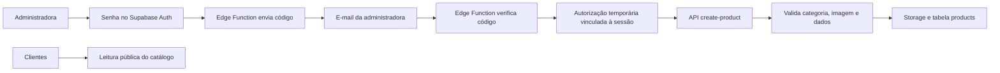

# USE MDR Beauty — Catálogo Web

Loja virtual responsiva da USE MDR, desenvolvida para navegação principalmente pelo celular e finalização de pedidos pelo WhatsApp.

- Site público: [use-mdr-beauty.netlify.app](https://use-mdr-beauty.netlify.app)
- Repositório público: o código da loja pode ser auditado, mas nenhum segredo administrativo é versionado.
- Clientes navegam, favoritam e montam pedidos sem login.
- O inventário é alterado exclusivamente pela administradora.

## Recursos

- catálogo conectado ao Supabase;
- categorias, subcategorias e busca;
- páginas individuais de produtos;
- favoritos sem login;
- carrinho persistente no navegador;
- alteração de quantidades, subtotais e total;
- pedido formatado automaticamente para o WhatsApp;
- layout responsivo com identidade visual própria da USE MDR.

## Segurança do inventário

O catálogo possui leitura pública, mas cadastro, alteração e exclusão são
protegidos por duas camadas independentes:

1. e-mail e senha da conta administrativa no Supabase Auth;
2. código aleatório de seis dígitos enviado ao e-mail da administradora.

O código vence em 10 minutos, aceita no máximo 5 tentativas e libera a API de
inventário por 30 minutos. A autorização fica vinculada à sessão que concluiu a
verificação. As políticas RLS do Supabase recusam gravações sem as duas camadas,
mesmo que alguém tente chamar a API fora da interface do site.



As chaves privadas, o segredo usado para proteger os códigos e a credencial do
provedor de e-mail ficam nos Secrets das Edge Functions. Consulte também
[SECURITY.md](SECURITY.md).

## Tecnologias

- Next.js;
- TypeScript;
- Tailwind CSS;
- Supabase;
- `localStorage` para carrinho e favoritos.

## Executar localmente

```bash
npm install
npm run dev
```

Abra [http://localhost:3000](http://localhost:3000).

## Variáveis de ambiente

Copie `.env.example` para `.env.local` e configure:

```env
NEXT_PUBLIC_SUPABASE_URL=
NEXT_PUBLIC_SUPABASE_PUBLISHABLE_KEY=
NEXT_PUBLIC_WHATSAPP_NUMBER=
```

O número do WhatsApp deve conter somente números, incluindo código do país e DDD.

O arquivo `.env.local` é ignorado pelo Git e não deve ser enviado ao repositório.

## Área administrativa

A página `/admin/produtos` permite cadastrar produtos e enviar imagens pelo
celular ou computador. O acesso utiliza uma conta do Supabase Auth e as
operações são protegidas por Row Level Security.

Para preparar o Supabase:

1. crie a conta da administradora em **Authentication > Users**;
2. abra `supabase/admin-catalog-setup.sql`;
3. substitua `ADMIN_EMAIL_AQUI` pelo e-mail da conta;
4. execute o arquivo no **SQL Editor** do Supabase;
5. configure os Secrets indicados em `supabase/functions/.env.example`;
6. publique as funções `request-admin-code`, `verify-admin-code` e
   `create-product`;
7. saia e entre novamente na área administrativa para atualizar a sessão.

### API de cadastro

A Edge Function `create-product` recebe uma única requisição autenticada em
`multipart/form-data` com nome, preço, categoria, subcategoria, descrição,
estoque e imagem. Ela valida a taxonomia, envia a foto ao bucket `products` e
insere o registro na tabela `products`. Se a inserção falhar, o upload é
removido automaticamente.

## Verificações

```bash
npm run lint
npm run build
```

## Hospedagem

O projeto pode ser publicado em uma plataforma compatível com Next.js. A opção gratuita considerada inicialmente é a Netlify, configurando nela as mesmas variáveis de ambiente.
