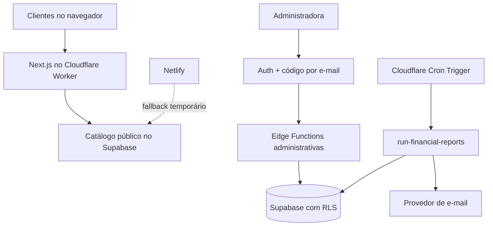

# USE MDR — Catálogo Web

Loja responsiva da USE MDR, desenvolvida principalmente para celular, com
catálogo no Supabase e finalização dos pedidos pelo WhatsApp.

- Produção atual/fallback: [use-mdr-beauty.netlify.app](https://use-mdr-beauty.netlify.app)
- Clientes navegam, pesquisam, favoritam e montam pedidos sem login.
- Estoque, destaques e finanças são exclusivos da administradora.
- Nenhum segredo administrativo é versionado no repositório público.

## Recursos

- catálogo, categorias, busca, produto, favoritos e carrinho;
- pedido formatado automaticamente para o WhatsApp;
- carrossel e imagens de categorias administráveis;
- cadastro e edição de produtos com limpeza das imagens substituídas;
- custo confidencial e snapshot de preço/custo em cada venda;
- vendas recebidas ou a receber e baixa transacional do estoque;
- despesas pagas ou pendentes;
- painel financeiro por hoje, semana e mês;
- faturamento, custos, lucros, ticket médio e rankings;
- fechamentos e relatórios automáticos por e-mail;
- Next.js preparado para Cloudflare Workers, com Netlify como fallback.

## Arquitetura



O catálogo recebe somente a chave publicável. Custos, despesas, lucros,
configurações e fechamentos passam por APIs protegidas. A Service Role fica
somente nos Secrets internos do Supabase.

## Tecnologias

- Next.js 16, React 19 e TypeScript;
- Tailwind CSS;
- Supabase Auth, Postgres, Storage e Edge Functions;
- Cloudflare Workers, OpenNext e Wrangler;
- Resend para entrega server-side dos e-mails;
- `localStorage` para carrinho e favoritos.

## Desenvolvimento local

```bash
npm install
npm run dev
```

Abra [http://localhost:3000](http://localhost:3000).

Copie `.env.example` para `.env.local`:

```env
NEXT_PUBLIC_SUPABASE_URL=
NEXT_PUBLIC_SUPABASE_PUBLISHABLE_KEY=
NEXT_PUBLIC_WHATSAPP_NUMBER=
```

O WhatsApp deve conter somente números, incluindo país e DDD. `.env.local` é
ignorado pelo Git.

## Administração e segurança

Rotas:

- `/admin/estoque`: produtos, imagens, preços, custos e quantidades;
- `/admin/destaques`: carrossel e imagens das categorias;
- `/admin/financas`: resumo, vendas, despesas e relatórios;
- `/admin/rendimentos`: redirecionamento compatível para a nova rota.

O acesso exige uma conta administrativa do Supabase Auth e um código aleatório
de seis dígitos enviado por e-mail. A autorização é vinculada à sessão e expira.
As Edge Functions repetem a validação no servidor; esconder a interface não é a
barreira de segurança. Consulte [SECURITY.md](SECURITY.md).

## Supabase e migrations

As migrations em `supabase/migrations` são aditivas e preservam `products` e
`sales`. A solução reutiliza `sales` em vez de criar tabelas duplicadas:

- `product_costs`: custo atual protegido, separado da tabela pública;
- `sales.unit_cost`: snapshot do custo no momento da venda;
- `expenses`: despesas pagas ou pendentes;
- `financial_closures`: retratos diário, semanal e mensal;
- `financial_report_settings`: destinatário e preferências;
- `financial_job_runs`: tentativas, status e idempotência.

Vendas anteriores à implantação recebem custo zero, pois não havia custo
histórico confiável. Novas vendas nunca são recalculadas pelo custo atual.

```bash
npx supabase migration list
npx supabase db push
npx supabase db lint --linked --level error
```

Funções administrativas:

- `create-product` e `manage-product`;
- `manage-hero-slide` e `manage-category-image`;
- `manage-sales` e `manage-finances`;
- `request-admin-code` e `verify-admin-code`;
- `run-financial-reports`.

## Secrets do Supabase

Use `supabase/functions/.env.example` como referência. Os principais são:

```env
ADMIN_EMAIL=
OTP_PEPPER=
RESEND_API_KEY=
EMAIL_FROM=USE MDR <relatorios@seudominio.com.br>
FINANCIAL_CRON_SECRET=
ADMIN_ALLOWED_ORIGINS=http://localhost:3000,https://use-mdr-beauty.netlify.app,https://SEU-WORKER.workers.dev
```

`FINANCIAL_CRON_SECRET` deve ser aleatório, possuir pelo menos 32 caracteres e
ter o mesmo valor no Supabase e no Worker. Nunca use `NEXT_PUBLIC_` para secrets.

## Finanças e fechamentos

O dia comercial usa `America/Recife` no banco:

- segunda a sexta: fechamento às 17h;
- sábado: fechamento às 13h;
- operações posteriores entram no próximo dia comercial;
- domingo é incorporado à segunda-feira.

O fechamento grava métricas atuais e comparação com o período anterior. A
restrição única impede duplicidade. Os e-mails também usam uma chave de
idempotência no provedor.

## Cloudflare Workers

Preview publicado e validado em 13/08/2026:

- [USE MDR na Cloudflare](https://use-mdr-beauty-preview.usemdr-web.workers.dev/)
- Worker: `use-mdr-beauty-preview`
- ambiente mobile, catálogo e acesso administrativo verificados;
- `FINANCIAL_CRON_SECRET` configurado no Worker e no Supabase;
- URL Cloudflare autorizada em `ADMIN_ALLOWED_ORIGINS`;
- Cron Triggers ativos para dias úteis e sábado.

O endereço Netlify continua ativo como fallback. Nenhum domínio ou DNS foi
transferido nesta etapa.

Arquivos principais:

- `open-next.config.ts`: adaptador e cache dos assets;
- `wrangler.jsonc`: runtime, bindings e Cron Triggers;
- `custom-worker.ts`: reaproveita o `fetch` do OpenNext e adiciona `scheduled()`;
- `cloudflare-env.d.ts`: tipos gerados pelo Wrangler.

Comandos:

```bash
npm run build
npm run build:cloudflare
npm run preview
npm run cf-typegen
npm run deploy:cloudflare
```

Configure no Cloudflare as variáveis públicas do `.env.example` e o secret:

```bash
npx wrangler secret put FINANCIAL_CRON_SECRET
```

O plano gratuito normal aceita Workers compactados de até 3 MB. A conta
temporária criada por `wrangler deploy --temporary` pode aplicar um limite
especial de 1 MB e, por isso, não é adequada para validar este bundle Next.js
(aproximadamente 1,3 MB compactado). Use uma conta Cloudflare gratuita real.

Os crons são UTC: `20:05` de segunda a sexta e `16:05` no sábado. A rotina
decide quando também criar o semanal e o mensal. Ela funciona sem navegador ou
painel aberto.

Após obter a URL final, adicione-a ao secret `ADMIN_ALLOWED_ORIGINS` do Supabase.

## Netlify como fallback

`netlify.toml` e o projeto Netlify não foram removidos. Enquanto o domínio não
for transferido, a implantação atual continua independente. Se o Worker falhar,
mantenha/restaure o DNS para a Netlify e corrija a branch Cloudflare sem alterar
o banco. Remova a configuração Netlify somente depois da validação definitiva.

## Verificações

```bash
npm run lint
npx tsc --noEmit
npm run test:finance
npm run build
npm run build:cloudflare
```

Antes da troca de domínio, valide catálogo, busca, carrinho, WhatsApp, login,
estoque, vendas, despesas, fechamentos, e-mail, responsividade e RLS na URL de
preview Cloudflare.
